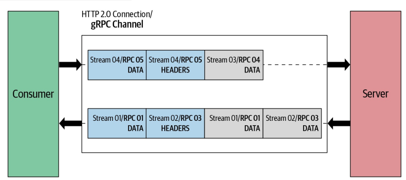

# Chapter 4. gRPC: Under the Hood

## RPC Flow
Let’s look at the `ProductInfo` service that we discussed in Chapter 2 to
understand how a remote procedure call works over the network. One of the
functions that we implemented as part of our `ProductInfo` service is
`getProduct`, where the client can retrieve product details by providing the
product `ID`.


we can identify the following key steps when the client
calls the `getProduct` function in the generated stub:
1. The client process calls the `getProduct` function in the generated stub.
2. The client stub creates an `HTTP POST` request with the encoded message. In
gRPC, all requests are `HTTP POST` requests with content-type prefixed with
`application/grpc`. The remote function (`/ProductInfo/getProduct`) that
it invokes is sent as a separate HTTP header.
3. The HTTP request message is sent across the network to the server machine.
4. When the message is received at the server, the server examines the message
headers to see which service function needs to be called and hands over the
message to the service stub.
5. The service stub parses the message bytes into language-specific data
structures.
6. Then, using the parsed message, the service makes a local call to the
`getProduct` function.
7. The response from the service function is encoded and sent back to the
client. The response message follows the same procedure that we observed
on the client side (response→encode→HTTP response on the wire); the
message is unpacked and its value returned to the waiting client process.

## Message Encoding Using Protocol Buffers
### Encoding Techniques
There are many encoding techniques supported by protocol buffers. Different
encoding techniques are applied based on the type of data. For example, string
values are encoded using **UTF-8** character encoding, whereas int32 values are
encoded using a technique called **varints**.

## Length-Prefixed Message Framing
In gRPC communication, 4 additional bytes are allocated for each
message to set its size. The size of the message is a finite number, and allocating
4 bytes to represent the message size means gRPC communication can handle all
messages up to 4 GB in size.


## gRPC over HTTP/2
The gRPC channel represents a connection to an
endpoint, which is an HTTP/2 connection. When the client application creates a
gRPC channel, behind the scenes it creates an HTTP/2 connection with the
server. Once the channel is created we can reuse it to send multiple remote calls
to the server. These remote calls are mapped to streams in HTTP/2. Messages
that are sent in the remote call are sent as HTTP/2 frames. A frame may carry
one gRPC length-prefixed message, or if a gRPC message is quite large it might
span multiple data frames.



### Request Message
In gRPC, the request message is always triggered by the client application and it consists of
three main components: request headers, the length-prefixed message, and the
end of stream flag. The remote call is initiated once the
client sends request headers. Then, length-prefixed messages are sent in the call.
Finally, the EOS (end of stream) flag is sent to notify the recipient that we
finished sending the request message.


Let's use the same `getProduct` function in the `ProductInfo` service to explain
how the request message is sent in HTTP/2 frames. When we call the
`getProduct` function, the client initiates a call by sending request headers as
shown here:
    
```
HEADERS (flags = END_HEADERS)
:method = POST                      
:scheme = http                      
:path = /ProductInfo/getProduct
:authority = abc.com
te = trailers
grpc-timeout = 1S
content-type = application/grpc
grpc-encoding = gzip
authorization = Bearer xxxxxx
```

1. Defines the HTTP method. For gRPC, the :method header is always POST.
2. Defines the HTTP scheme. If TLS (Transport Level Security) is enabled, the scheme is set to “https,” otherwise it is “http.”
3. Defines the endpoint path. For gRPC, this value is constructed as “/”{service name} “/”{method name}.
4. Defines the virtual hostname of the target URI.
5. Defines detection of incompatible proxies. For gRPC, the value must be “trailers.”
6. Defines call timeout. If not specified, the server should assume an infinite timeout.
7. Defines the content-type. For gRPC, the content-type should begin with
application/grpc. If not, gRPC servers will respond with an HTTP status of 415 (Unsupported Media Type).
8. Defines the message compression type. Possible values are identity, gzip, deflate, snappy, and {custom}.
9. This is optional metadata. authorization metadata is used to access the secure endpoint.

Once the client initiates the call with the server, the client sends length-prefixed
messages as HTTP/2 data frames. If the length-prefixed message doesn’t fit one
data frame, it can span to multiple data frames. The end of the request message
is indicated by adding an `END_STREAM` flag on the last DATA frame. When no data
remains to be sent but we need to close the request stream, the implementation
must send an empty data frame with the `END_STREAM` flag.

### Response Message

The response message is generated by the server in response to the client’s
request. Similar to the request message, in most cases the response message also
consists of three main components: response headers, length-prefixed messages,
and trailers. When there is no length-prefixed message to send as a response to
the client, the response message consists only of headers and trailers.


When the server sends a response to the client, it first sends
response headers as shown here:
```
HEADERS (flags = END_HEADERS)
:status = 200
grpc-encoding = gzip
content-type = application/grpc
```

1. Indicates the status of the HTTP request.
2. Defines the message compression type. Possible values include `identity`,`gzip`, `deflate`, `snappy`, and `{custom}`.
3. Defines the `content-type`. For gRPC, the `content-type` should begin with `application/grpc`.

Similar to the request message, if the length-prefixed message doesn’t fit one data frame, it can span to multiple data frames.
As shown in the following, the `END_STREAM` flag isn’t sent with data frames. It is
sent as a separate header called a trailer.

### Understanding the Message Flow in gRPC Communication Patterns

**Simple RPC**


**Server-streaming RPC**


**Client-streaming RPC**


**Bidirectional-streaming RPC**
